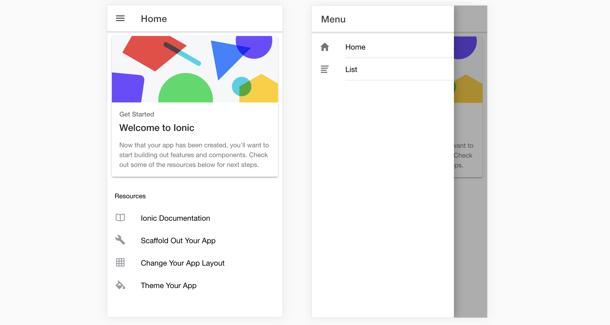

```
☰  React Side Menu Starter App
────────────────────────────────────────
╭──╮  ╭─────●╮  ╭──┬───╮  ╭──╮  ╭──────╮
├──┤  │  ╭╮  │  │      │  ├──┤  │ `╭───╯
│  │  │  ╰╯  │  │  ╭╮  │  │  │  │  ╰───╮
╰──╯  ╰──────╯  ╰──╯╰──╯  ╰──╯  ╰──────╯
```
> A starter app built with Ionic React in Javascript without a build step.

[](https://websemantics.github.io/ionic-react-sidemenu-app/public/index.html)

## Overview

This app is the JavaScript transpile of [Ionic React Side Menu App](https://github.com/ionic-team/starters/tree/master/react/official/sidemenu) organized to work without a build step by using,

* [ESM Modules](https://developer.mozilla.org/en-US/docs/Web/JavaScript/Guide/Modules) and
* [Import Maps](https://github.com/WICG/import-maps).



## Similar Apps

* [Conference App](https://github.com/websemantics/ionic-react-conference-app)
* [Photo Gallery App](https://github.com/websemantics/ionic-react-photo-gallery-app)
* [Tabs Starter](https://github.com/websemantics/ionic-react-tabs-app)
* [Blank Starter](https://github.com/websemantics/ionic-react-blank-app)
* [Test App](https://github.com/websemantics/ionic-react-test-app)

## Support

Need help or have a question? post a questions at [StackOverflow](https://stackoverflow.com/questions/tagged/ionic-react-sidemenu-app+web+semantics)

*Please don't use the issue trackers for support/questions.*

## Contributions

Happy to accept external contributions to the project in the form of feedback, bug reports and even better - pull requests

## Copyright and license

[MIT license](http://opensource.org/licenses/mit-license.php)
Copyright (c) Web Semantics, Inc.
